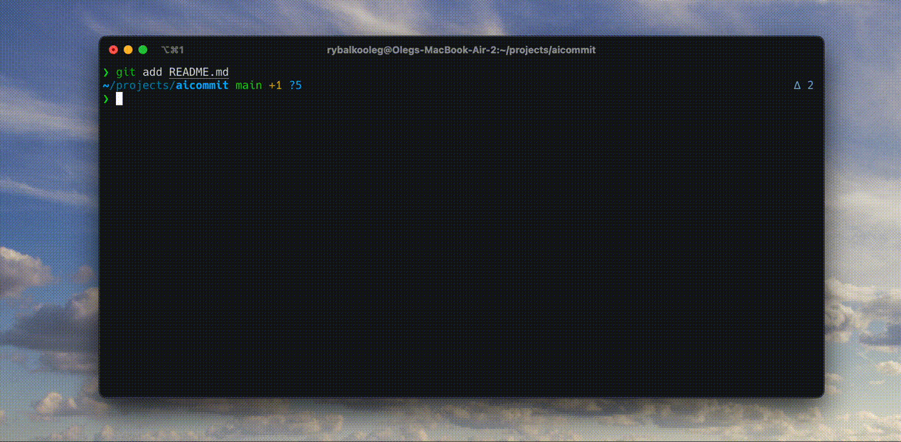

# aicommit

Tired of installing millions of dependencies just to write commits with ollama? I am, so I wrote a shell script which does that with just curl and jq!

## Installation

1. Install [ollama](https://ollama.com/), [curl](https://curl.se/), and [jq](https://jqlang.github.io/jq/).
2. Add `aicommit` function to your zsh shell:

```sh
curl https://raw.githubusercontent.com/SkullMag/aicommit/main/aicommit.sh >> ~/.zshrc
exec zsh
```

## Usage
1. Add your changes to git.
2. Run `aicommit` to generate a commit message for you.

